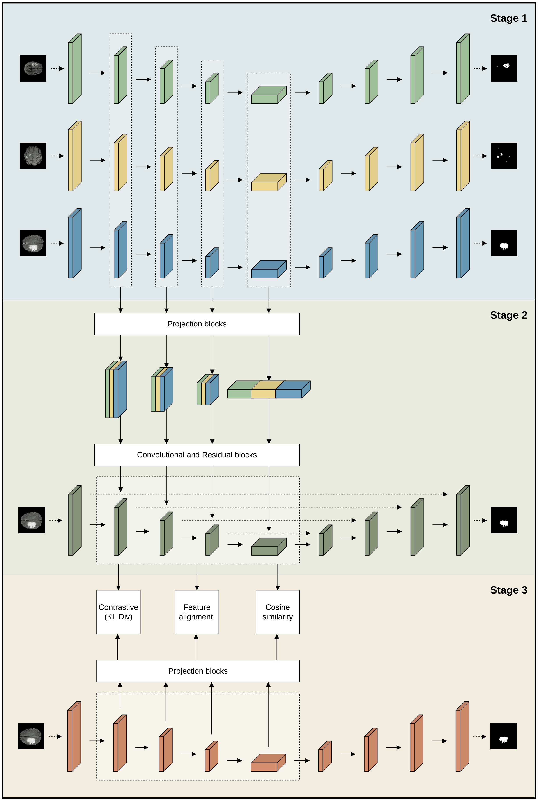

# Multi-Teacher Feature Fusion: A Lightweight Alternative to Adversarial Domain Adaptation for Medical Image Segmentation

This repository contains the implementation of our multi-teacher knowledge distilation framework. The proposed framework combines knowledge from multiple dataset-specific teachers through multi-level feature fusion and transfers it to dataset-specific student models using feature-level  knowledge distillation. Unlike adversarial domain adaption methods, our approach doess not require domain classifiers or adversarial training.

The framework is evaluated on seven MRI and CT datasets, using three segmentation architectures: U-Net, TransResU-Net and SegFormer.

## Method overview
The proposed framework consists of three training stages:

1. **Individual Teacher Training**: independent segmentation models are trained on each dataset.
2. **Fused Teacher Training**: the dataset-specific teachers are frozen and their intermediate representations are co bined through multi-level feature fusion to train a fused teacher
3. **Knowledge Distillation**: the fused teacher transfers knowledge to dataset-specific student models through a combination of segmentation supervision and feature-level distillation losses.

<p align="center">
  
</p>

## Datasets
The framework is evaluated on seven medical imaging datasets. All experiments use 2D image slices.

### **MRI** modality:

1. **BrainMetShare**: brain metastases, approximately 18K slices
2. **BraTS 2020**: brain tumors, approximately 57K slices.
3. **BraTS-PED 2023**: pediatric brain tumors, approximately 15K slices.
4. **ISLES 2022**: ischemis stroke lesions, approximately 15K slices.

### **CT** modality:

1. **KiTS 2019**: kidney tumors, approximately 15K slices.
2. **LiTS 2017**: liver tumors, approximately 11K slices.
3. **Lung MSD**: lung tumors, approximately 4K slices.

The data-loading implementation expects each dataset to have the folllowing directory structure:

```text
datasets/
└── dataset_name/
    ├── images/
    ├── masks/
    ├── train.txt
    ├── val.txt
    └── test.txt
```

- **images/**: contains the input images.
- **masks/**: contains the corresponding ground-truth segmentation masks.
- **train.txt**: lists the filenames of the training samples.
- **val.txt**: lists the filenames of the validation samples.
- **test.txt**: lists the filenames of the test samples.

The framework uses balanced sampling during fused-teacher training to ensure equal representation of the different datasets.

## Repository Structure
- `data.py`: dataset loading and preprocessing, data augmentation, train/validation/test split handling and balanced batch sampling
- `metrics.py`: Dice and Binary Cross-Entropy (BCE) segmentation loss, computation of evaluation metrics (IoU, Dice, Recall, Precision and HD95) and aggregation of results
- `utils.py`: reproducibility utilities, training and evaluation logging, model checkpoint saving and loading and initialization and freezing of models
- `model_unet.py`: U-Net architecture and feature adapter
- `model_segformer.py`: SegFormer architecture and feature adapter
- `model_tresunet.py`: TransResU-Net and fused teacher architectures
- `train_dataset_specific.py`: training and evaluation of individual teacher models
- `train_fused.py`: training and evaluation of the fused teacher
- `train_kd_tresunet.py`: training and evaluation of TransResU-Net students using knowledge distillation
- `train_kd_unet.py`: training and evaluation of U-Net students using knowledge distillation
- `train_kd_segformer.py`: training and evaluation of SegFormer students using knowledge distillation
